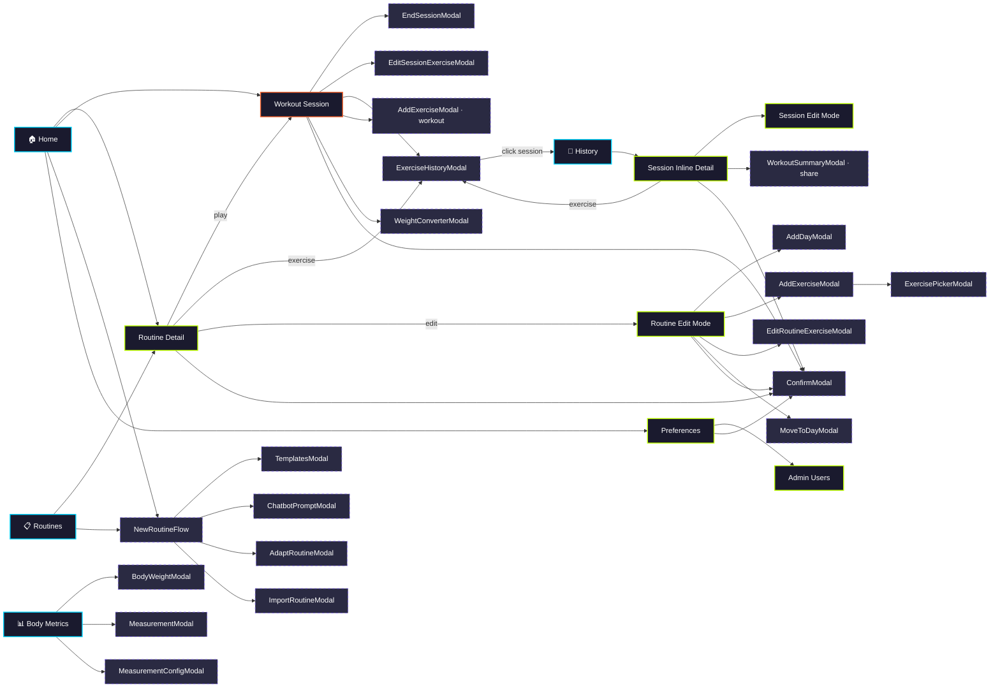

# Navigation Flow

## Legend

| Style | Meaning |
|-------|---------|
| 🟢 Lime border | Page / Screen |
| 🔵 Cyan border | Tab (entry point) |
| 🟣 Purple dashed | Modal / Bottom Sheet |
| 🟠 Orange border | Overlay (workout session) |

## Shared Components

These are used from **multiple screens**:

| Component | Used from |
|-----------|-----------|
| **ExerciseHistoryModal** | Routine Detail, Workout Session, Session Detail |
| **NewRoutineFlow** | Home, Routines |
| **Workout Session** | Home (free), Routine Detail (play) |
| **ConfirmModal** | Routine Detail, Routine Edit, Workout Session, Session Detail, Preferences |
| **WorkoutSummaryModal** | Workout Session (end), Session Detail (share) |
| **AddExerciseModal** | Routine Edit, Workout Session |

## Stats

- **4 tabs** — Home, History, Routines, Body Metrics
- **8 pages** — Routine Detail, Preferences, Admin, Session Detail, etc.
- **23 modals** across the app
- **1 overlay** — Workout Session
